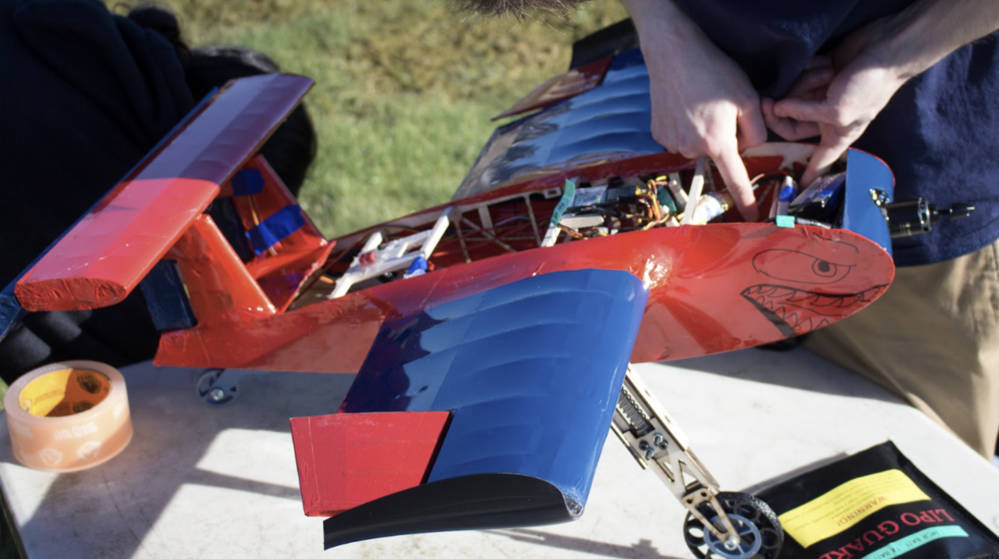
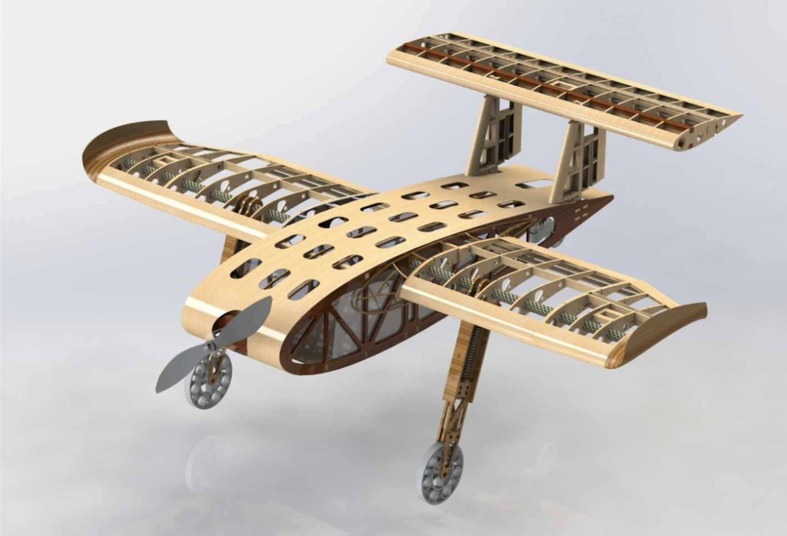
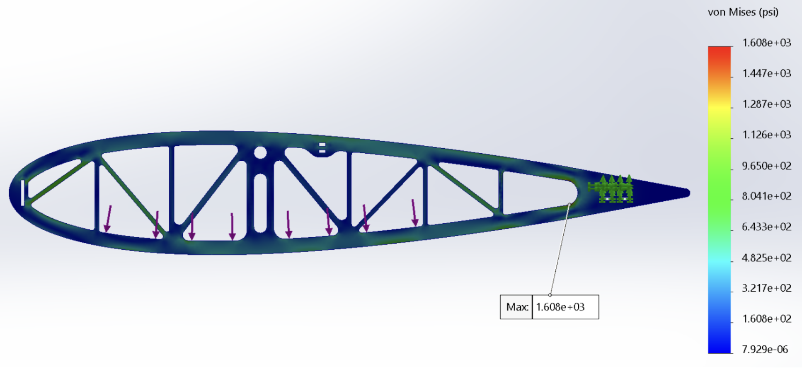
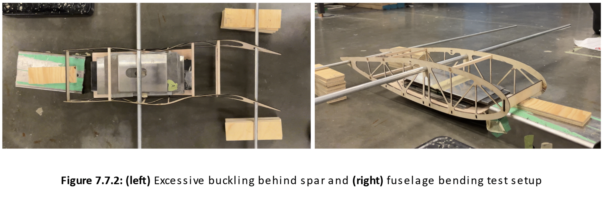
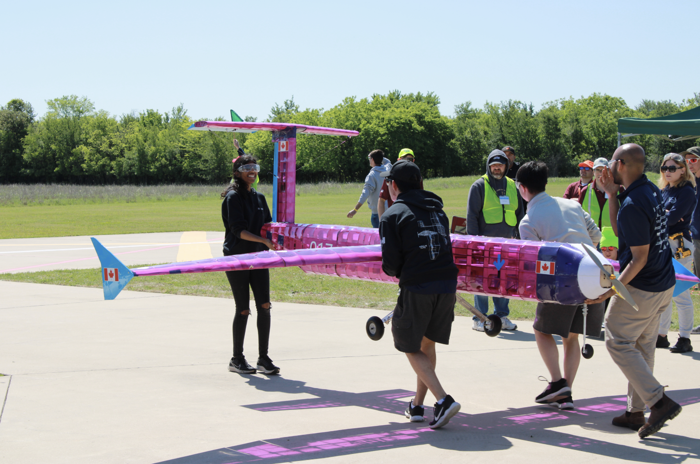
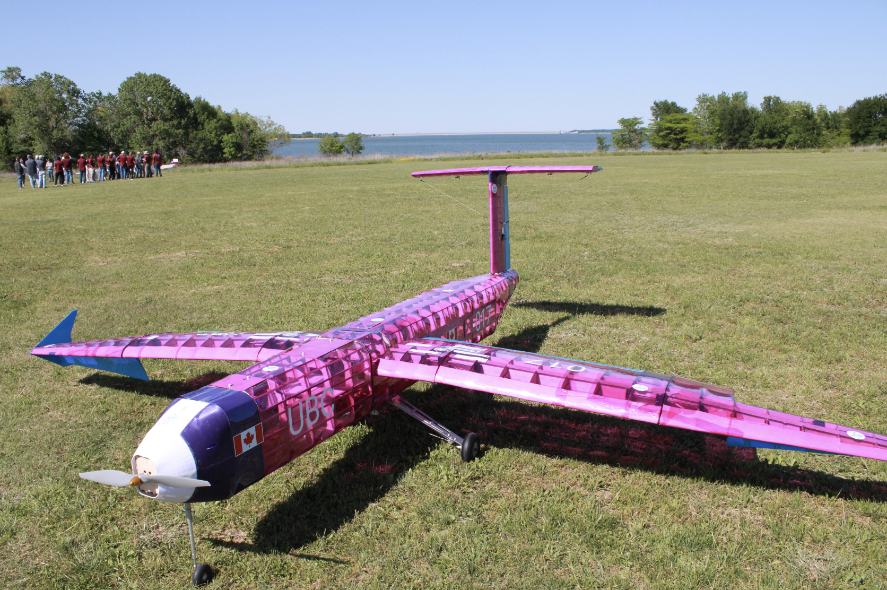
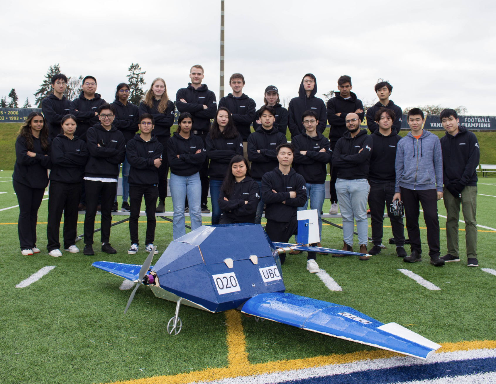

## TLDR;
Led the structural design of the fuselage of a 
super-lift RC aircraft that weighed ~3lbs 
empty and flew with 2.2 lbs of water. I used 
FEA to optimize for weight-to-strength and 
performed physical validation via bending 
and torsional tests. I communicated with the electrical teams to 
manage wire/component layout, the 
wing team to design a flow-transition region, 
and delegated tasks within my own team 
to design and build empennage connections and landing gears.

[Watch it fly!](#video)

### 2023-24 "Sonic"

## About AeroDesign
UBC AeroDesign participates in SAE's Aero Design annual competition,
 competing with 40+ teams in Micro, Regular, and Advanced class categories,
 each category presenting a different engineering challenge every three years.

### Micro Class
The main design objectives in micro class are:
- Minimize wingspan
- Minimize empty weight (total weight - payload)
- Maximize (liquid) payload capacity
- Minimize takeoff distance

### Regular Class
The main objectives in regular class are:
- Maximize payload
- Maximize wingspan
- Accurate estimation of payload capacity

## Micro Class
### 2023-24 "Sonic"
As a lead for UBCAD's micro class team over the 2023-24 design cycle, I played a large role
in the design, analysis, and construction of the main fuselage, water payload container, electrical layout,
and interfaces with parts such as landing gear, empennage, and wings.

#### Structural Analysis
The fuselage's main structural members were built of two longitudinal plywood ribs spanning the payload container's width. Testing was done in FEA (SolidWorks) and physical tests were also performed to validate the analysis.
Stiffeners were used to increase the stiffness along the lateral axis and mitigate twisting. Shear and bending analysis were also conducted to determine the optimal number, placement, size, and material of key stiffeners.

In FEA, I chose a larger-than-typical safety factor (2.8, normally ~1.2-1.4 for aircraft to reduce weight) to account for plywood’s anisotropic nature, unaccounted in simulation. To further validate the analysis, bending and torsional testing was done on a prototype fuselage.

- Conducted structural analysis to optimize material selection for strength-to-weight ratio
- Verified analysis using physical testing
- Supervised spreadsheet analysis for other parts of the plane, such as empennage connections

#### Design and Manufacturing
- Designed and modelled the majority of the fuselage in Solidworks using DFMA methods
- Designed the flow transition region surface between the fuselage and the wing using surface modelling methods
- Manufactured wood parts using laser-cutters and non-planar geometries using 3D printers
- Streamlined construction by minimizing part counts, creating BoMs & build plans, labelling, and use of jigs

#### Team Logisitics
- Trained new members for analysis, solid modelling, and manufacturing
- Wrote design reports and presented in team-wide design reviews for effective integration
- Created timelines and distributed tasks for members to bolster team output

#### Results
- Reduced fuselage weight by 60% from initial designs through [analysis](#structural-analysis)
- Successfully [flew](#video) with 2.2 lbs of liquid water payload
- Built two competition planes and several prototype models (2 flight-worthy)
- 7 flight attempts under poor weather conditions at competition
- Placed 8th overall in SAE West

## Regular Class
### 2022-23 "Indomitable"
- 135” airplane
- Carried metal plate payload
- Lots of designing in Solidworks; I did the main cabin, including interfaces with landing gear, wings, and 
two other cabins
- Some insane hours for many weeks on end to build this monster of a plane
- This year really developed the "Indomitable" spirit

### 2021-22 "Snorlax"
- First year on the team
- Designed the hatch and assisted structural analysis (spreadsheet)
- Performed fuselage drag analysis in Simscale
- Carried 9 soccer balls

## Video
Watch Sonic fly (and land):
